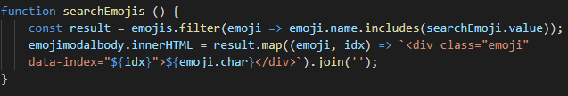

#Mark Annandale Lab 6

##.map function and arrow functions

[https://developer.mozilla.org/en-US/docs/Web/JavaScript/Reference/Functions/Arrow_functions]

For my assignment, I chose make use of arrow functions, most notably the .map function. This function has the benefit of, essentially, being shorter than normes ES5 functions, simplifying the code and freeing up some space.

```
const newHTML = gifs.map((gif,idx) => ``).join('');
```

